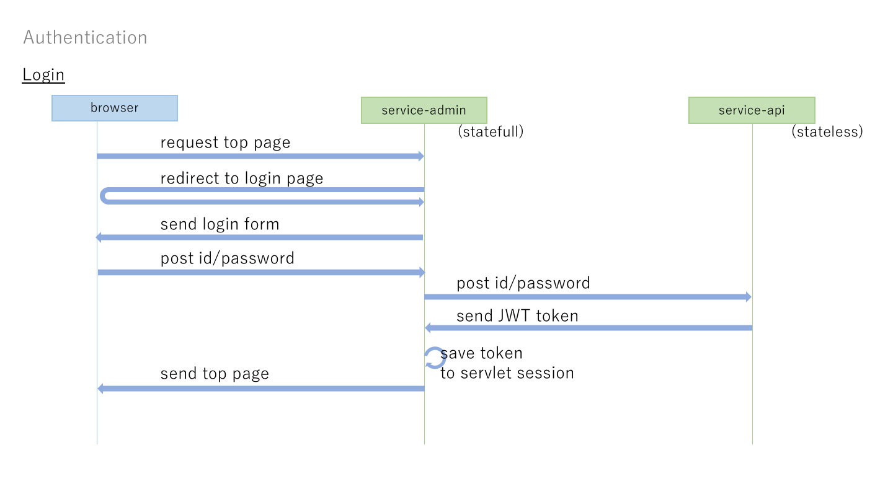

# Authentication Function

Service authentication has following functions.
- api authentication (stateless)
- web application authentication (statefull)

Backend of web applications authentication is api authentication, like below diagram.

Currently api authentication is used from web application only.
In the future, smart phone application call api authentication directly.
