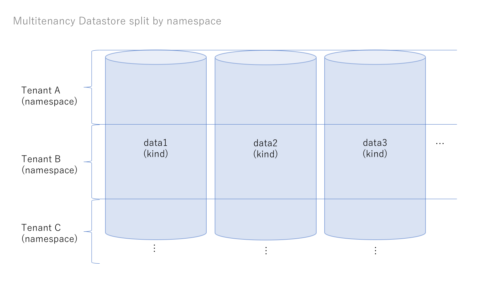
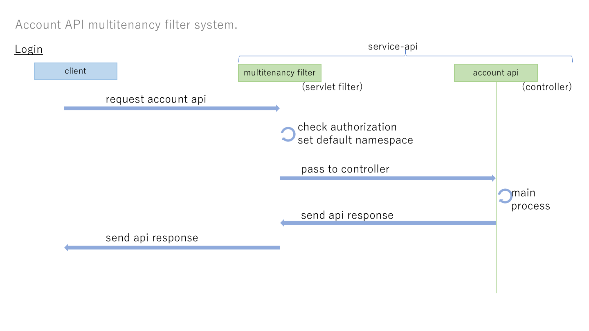

# Multitenancy Function

Multitenancy implements by Datastore Namespace system.

## Multitenancy DataStore

DataStore Kind split by namespce, Name of namespace is account (tenant) id.

## Multitenancy Filter

Account API have filter system, by servlet filter and spring security authorization.

Multitenancy filter (servlet filter) has following functions.

- Check authorization
- Set default namaspace

### Check authorization

check permission that login user has request data of account.

When client request ``<service-domain>/account/00001/anypath``, this api is account api request of account (AccountId is 00001).  
Login user is member of account (AccountId is 00001), return response of account api.  
but Login user is not member, return 403 Forbidden.

### Set default namaspace

set default namespace of datastore api.

When client request account api ``<service-domain>/account/00001/anypath``, multitenancy filter set default namespace to ``00001`` (AccountID is 00001).
And account api access to account-oriented data of datastore.

## Reference

Implementing Multitenancy Using Namespaces | Google Cloud
https://cloud.google.com/appengine/docs/standard/java/multitenancy/multitenancy?hl=ja
