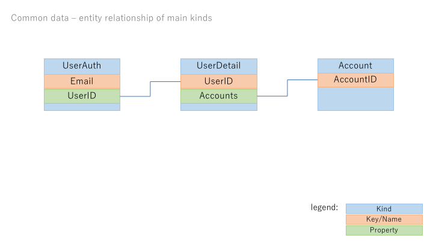

# common-data (cloud datastore)

Account-shared data of this service.

Namespace is ``default``.

## UserAuth

Kind: UserAuth

Properties:
- Email (String, Name/ID) ... login user email address
- UserId (Integer)... ID of UserDetail kind.

Example:

|Name/ID(Email)|UserId|
|--|--|
|taro.yamada@example.com|1|
|hanako.tanaka@example.com|2|

## UserDetail

Kind: UserDetail

- UserID (Integer, Name/ID) ... ID, auto-generated numeric id.
- Password (String) ... encrypted password.
- FirstName (String)
- LastName (String)
- Accounts (Array) ... account id list.

Example:

|Name/ID(UserID)|Password|FirstName|LastName|Accounts|
|--|--|--|--|--|
|1|xxxxxxxx|Taro|Yamada|[1,2]|
|2|yyyyyyyy|Hanako|Tanaka|[2]|

## Account

Kind: Account

- AccountID (Integer, Name/ID) ... ID, auto-generated numeric id.
- Name (String) ... account name.

Example:

|Name/ID(AccountID)|Name|
|--|--|
|1|Tenant X|
|2|Tenant Y|
