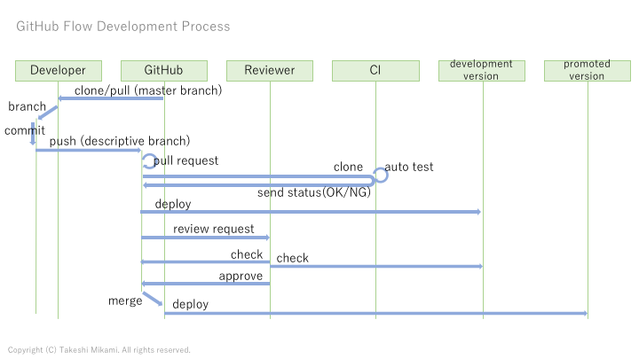

# Development process

Development process is GitHub Flow based process.



GitHub Flow:  
http://scottchacon.com/2011/08/31/github-flow.html


## Prepare local repository

clone target repository from GitHub.

```
git clone git@github.com:<organization>/<repository>.git
cd <repository>
```

if you already cloned, pull from latest source code of master branch.

```
git checkout master
git pull
```


## Create local branch and commit

create local descriptively named branch. (ie: add-springboot-auth)

```
git checkout -b <branch name>
```

implement issue, commit to this branch locally.

```
git commit ....
```

## Push to github and pull request

after create local branch, you can push to github and create pullrequest.
you don't need implement completely, we can discuss of pull request comments.

push your branch to GitHub.

```
git push origin <branch name>
```

create pull request of GitHub UI.

- repository top -> Code -> branches -> 'New pull request' button of your branch
- write subject and comment, and push 'Create pull request' button
   - set '[wip]' to subject prefix if you developping.
   - set '[in-review]' to subject prefix if you developed and request review.
   - write issue number to purpose of comment, if you have relative issue.

after create pull request, start ci & deploy automatically.

- check ci status in bottom of Pull Request Conversation, green is ok.
- check deployed development version, from 'View Deployment' link of Pull Request Conversation.

if you find problem, fix code, commit, and push again.


## Review request

after self-check of your pull request, you can request review.

add reviewer to Pull Request, in right side of Pull Request Conversation page.

after review approve, merge and deploy promoted version.
