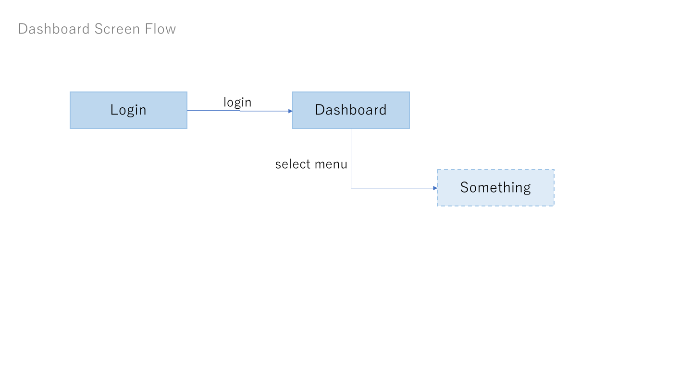
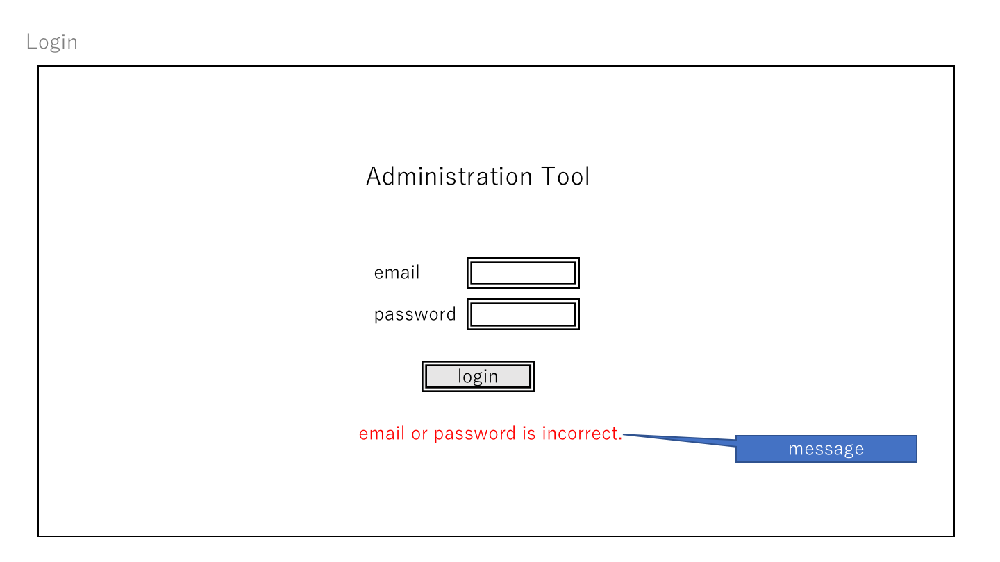
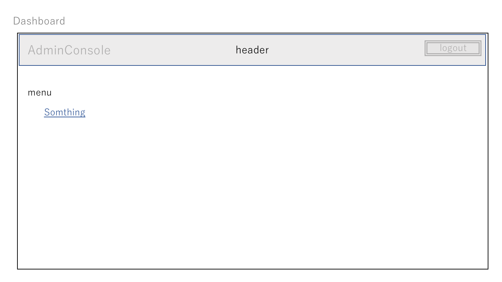

# Login and Dashboard

## Login

### ScreenFlow

To
- Dashboard ... click ``login`` button, if correct email & password

### Elements

Input
- email (textbox, required)
- password (textbox, required)

Display
- message ... display message, if incorrect email or password

Control
- login (button) ... to Dashboad

## Dashboard

### Parts
- [Header Parts](../parts/index.md#header)

### ScreenFlow

To
- somthing ... click ``somthing`` link

### Elements

Control
- somthing (link) ... to somthing
